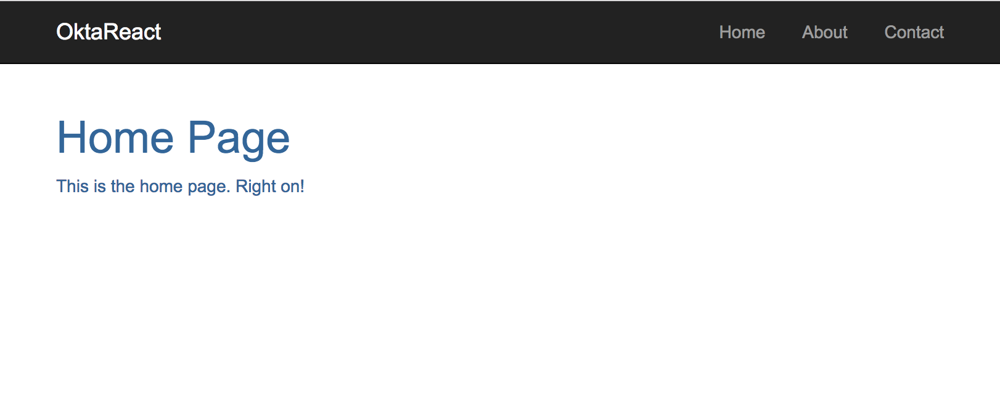
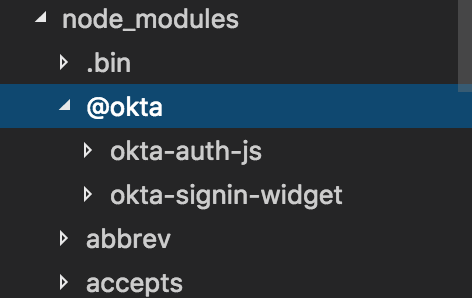
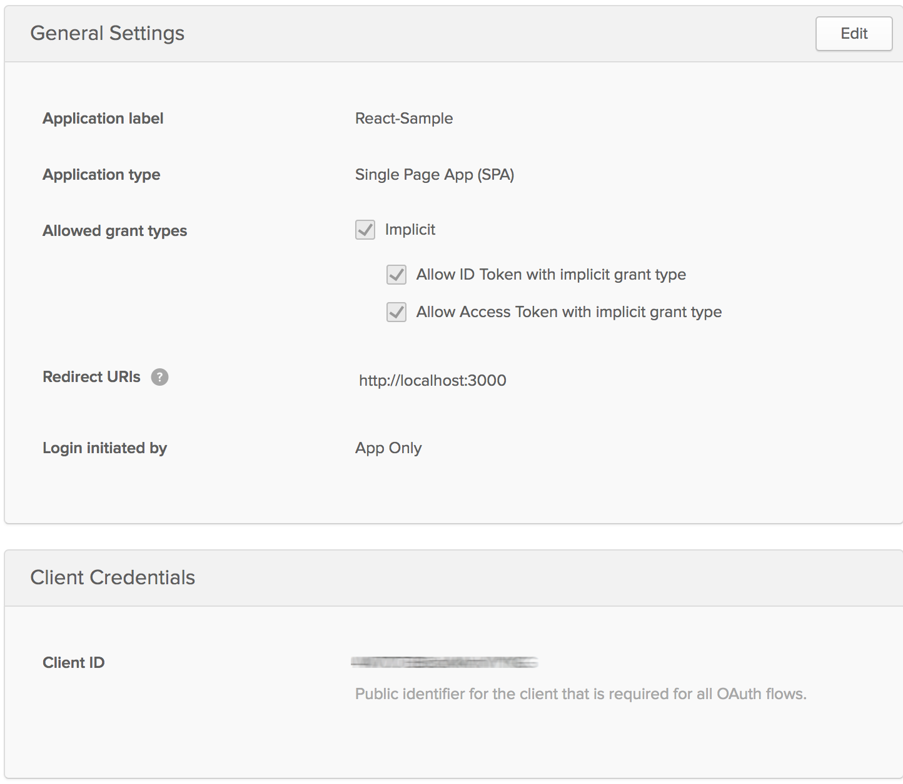

# Build a React Application with User Authentication in Minutes

React has quickly become one of the most favored front-end web frameworks. It is second only to plain old HTML5, [according to JAXenter](https://jaxenter.com/technology-trends-2017-top-frameworks-131993.html). So it is no surprise that developers are learning it, and employers are asking for it.

In this tutorial, we’ll start with a very simple react app with a couple of pages and some routing built in, but not much more, and we’ll add authentication to it using [Okta’s Sign-In Widget](http://developer.okta.com/code/javascript/okta_sign-in_widget). The Sign-In Widget is an embeddable Javascript widget that allows us to use Okta’s secure, scalable architecture with a minimum of effort from within our react app. Let’s get started!

## Getting The Simple React Seed Project

Start by cloning the simple react seed project.

```bash
git clone https://github.com/leebrandt/simple-react-seed.git okta-react-widget-sample
cd okta-react-widget-sample
npm install
npm start
```
When you open `http://localhost:3000`, you should see something like the below:

 

When you click on the navigation links, you should see page placeholders for those links.

## Adding the Okta SignIn Widget


Install the [Okta Sign-In Widget](https://github.com/okta/okta-signin-widget) using npm. Note that [using Yarn won't work](https://github.com/okta/okta-signin-widget/issues/191).

```bash
npm install @okta/okta-signin-widget --save
```

This will add the Okta Sign-In Widget code to your node_modules folder.



## The LoginPage Component

We'll first create a folder called `auth` in the `./src/components` folder, then we'll create file called `LoginPage.js` where our `LoginPage` component will go.

We'll start with the most basic of components

```js
import React from 'react';

export default class LoginPage extends React.Component{
  render(){
    return(
      <div>Login Page</div>
    );
  }
}
```

This little component doesn't *do* much but we at least now have a handle to add the `LoginPage` to our routing. So in our `./src/app.js` file, we'll import the component with:

```js
import LoginPage from './components/auth/LoginPage';
``` 
and then add the route inside our main route (the one with the path of "/")
```js
<Route path="/login" component={LoginPage}/>
```

## Adding the OIDC Application in Okta
In order for us to *use* Okta as out OpenID Connect provider for authentication, we'll need to set up an application in the [Okta developer portal](http://developer.okta.com/).

So login to your Okta account, or create one at http://developer.okta.com if you don't have one. Navigate to Admin > Add Applications and click on the Create New App button. Select Single Page App (SPA) for the Platform and OpenID Connect for the sign on method. Click the Create button and give your application a name. On the next screen, add http://localhost:3000 as a Redirect URI and click Finish. You should see settings like the following.



Make not of the `Client ID` (yours shouldn't be blurred out) and make note of your Dev ID (it's the number part of the subdomain of the URL you are at) So if you are at https://dev-1234-admin.oktapreview.com/... your Dev ID is 1234. So let's set up the widget to talk to our new app!

## Adding the Widget to Our Component
```js
import React from 'react';
import OktaSignIn from '@okta/okta-signin-widget';

export default class LoginPage extends React.Component{
  constructor(){
    super();
    this.widget = new OktaSignIn({
      baseUrl: 'https://dev-[dev id].oktapreview.com',
      clientId: '[client id]',
      redirectUri: 'http://localhost:3000',
      authParams: {
        responseType: 'id_token'
      }
    });
  }

  render(){
    return(
      <div>Login Page</div>
    );
  }
}
```

Now, we've imported the `OktaSignIn` function from the [Okta Sign-In Widget]() `npm` module we installed earlier. Then, in the constructor of our component, we initialize an instance of `OktaSignIn` with the configuration for our application. This way, our application code will be able to talk to Okta, and Okta will recognize that this is the app we just created.

## Show The Login Widget
Now we create the code to actually render the Sign-In Widget to the page! We'll need to change our render method to create an HTML element we can render the widget into. Then, add a `componentDidMount` function to make sure we don't try to render the widget before the HTML element is on the page.

```js
import React from 'react';
import OktaSignIn from '@okta/okta-signin-widget';

export default class LoginPage extends React.Component{
  constructor(){
    super();
    this.state = {user:null};
    this.widget = new OktaSignIn({
      baseUrl: 'https://dev-[dev id].oktapreview.com',
      clientId: '[client id]',
      redirectUri: 'http://localhost:3000',
      authParams: {
        responseType: 'id_token'
      }
    });
  }

  componentDidMount(){
    this.widget.renderEl({el:'#okta-login-container'},
      (response) => {
        this.setState({user: response.claims.email});
      },
      (err) => {
        console.log(err);
      }
    );
  }

  render(){
    return(
      <div id="okta-login-container" />
    );
  }
}
```
We also added state to our component. If you're using a flux implementation, this would naturally come from the app state. But to keep this tutorial simple, we'll let our little `LoginPage` keep track of it's own state.

## Check If The User Is Logged In
We don't necessarily want to render the widget right away. We'll need to add some code to check to make sure the user isn't already logged in, and we'll move our `renderEl` out to a function called `showLogin`. 

```js
 // ...other stuff removed for brevity's sake
 componentDidMount(){
    this.widget.session.get((response) => {
      if(response.status !== 'INACTIVE'){
        this.setState({user:response.login});
      }else{
        this.showLogin();
      }
    });
  }

  showLogin(){
    Backbone.history.stop();
    this.widget.renderEl({el:'#okta-login-container'},
      (response) => {
        this.setState({user: response.claims.email});
      },
      (err) => {
        console.log(err);
      }
    );
  }
```
>*You might have noticed a weird bit of code in that `showLogin` method. That first line: `Backbone.history.stop()`. The widget itself uses [Backbone.js]() to navigate between its own screens (login, forgot password, etc.), and when it renders, it starts the `Backbone.history`. Since we've now moved it out into a `showLogin` function, we're going to re-render the widget whenever the function is called. So this is just a little trick to tell Backbone to stop the history, because we're going to restart it when we render the widget.*

## Putting It All Together
Let's wrap this up. We'll make sure we bind the class's `this` context to each of our methods. We Added a `logout` method, and we changed our `render` method to make a decision on what to render, based on whether there is a currently logged in user.

So our final `LoginPage.js` should look like this.

```js
import React from 'react';
import OktaSignIn from '@okta/okta-signin-widget';

export default class LoginPage extends React.Component{
  constructor(){
    super();
    this.state = { user: null };
    this.widget = new OktaSignIn({
      baseUrl: 'https://dev-[dev id].oktapreview.com',
      clientId: '[client id]',
      redirectUri: 'http://localhost:3000',
      authParams: {
        responseType: 'id_token'
      }
    });

    this.showLogin = this.showLogin.bind(this);
    this.logout = this.logout.bind(this);
  }

  componentDidMount(){
    this.widget.session.get((response) => {
      if(response.status !== 'INACTIVE'){
        this.setState({user:response.login});
      }else{
        this.showLogin();
      }
    });
  }

  showLogin(){
    Backbone.history.stop();
    this.widget.renderEl({el:'#okta-login-container'}, 
      (response) => {
        this.setState({user: response.claims.email});
      },
      (err) => {
        console.log(err);
      }
    );
  }

  logout(){
    this.widget.signOut(() => {
      this.setState({user: null});
      this.showLogin();
    });
  }

  render(){
    return(
      <div>
        {this.state.user ? (
          <div className="container">
            <div>Welcome, {this.state.user}!</div>
            <button onClick={this.logout}>Logout</button>
          </div>
        ) : null}
        {this.state.user ? null : (
          <div id="okta-login-container" className="login" />
        )}
      </div>
    );
  }
}
```

## Checking It Out
When we run the app now (with `npm start`), we should see something like this:


If it works - congrats! If it doesn't, please post a question to Stack Overflow with an [okta tag](http://stackoverflow.com/questions/tagged/okta), or hit me up [on Twitter](https://twitter.com/leebrandt).

## Known Issues

There is one known issue in this tutorial. The widget's CSS takes over the whole page and will override your app's CSS. This is a [documented issue](https://github.com/okta/okta-signin-widget/issues/126) and you can see [Matt Raible's comment on it](https://github.com/okta)

## React + Okta

You can find a completed version of the application created in this blog post [on GitHub](https://github.com/leebrandt/okta-react-widget-sample). 

Building authentication in an application is hard. It’s even less fun to build it over and over again in each application you build. Okta does the hard part for you and makes it a lot more fun to be a developer! Sign up for a forever-free developer account and try Okta today!

I hope you’ve enjoyed this quick tour of our React support. If you have questions about Okta’s features, or what we’re building next, please hit me up [on Twitter](https://twitter.com/leebrandt), leave a comment below, or open an issue on GitHub. 


